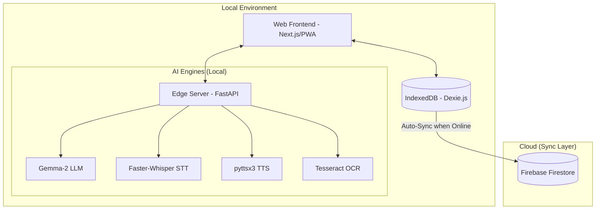

# Sahayak - AI Classroom Assistant

> **Empowering every classroom with multilingual, offline-first Edge AI.**

Sahayak (meaning "Helper" in Sanskrit) is a next-generation AI-powered assistant designed for classrooms, specifically tailored for areas with intermittent internet connectivity. It provides students and teachers with a rich, interactive learning experience using local Edge AI processing, ensuring privacy and continuous learning even when offline.

---

## 🏗️ Architecture

Sahayak follows a robust hybrid-offline architecture, combining the performance of local Edge AI with the scale of cloud synchronization.



### Component Breakdown
- **apps/web**: A Next.js 16+ Progressive Web App (PWA) that provides a seamless user experience on Mobile, Tablets, and Desktop.
- **apps/edge-server**: A high-performance Python backend that hosts and serves the local AI models.

---

## ✨ Key Features

### 🚀 Edge AI (Offline-First)
- **Local LLM**: Privacy-first chat and tutoring powered by Google's Gemma-2 (quantized).
- **Voice-to-Text (STT)**: Transcribe classroom lectures and student questions in real-time using Faster-Whisper.
- **Text-to-Speech (TTS)**: Multilingual voice synthesis for reading lessons and providing feedback.
- **Visual Learning (OCR)**: Extract text and solve problems from images of handwritten notes or textbooks.

### 🌍 Multilingual Support
- Interactive assistance in native Indian languages (Hindi, Bengali, Tamil, etc.).
- Real-time translation to bridge the language gap in diverse classrooms.

### 🔄 Proactive Sync
- Intelligent data management using **Dexie.js** for local persistence.
- Automatic background synchronization to **Firebase** as soon as an internet connection is detected.

### 📊 Role-Based Dashboards
- **Teachers**: Manage classes, track student progress with AI-driven analytics, and generate smart worksheets.
- **Students**: Access personalized learning paths, submit assignments via voice/image, and chat with an AI tutor.

---

## 🛠️ Tech Stack

### Frontend
- **Framework**: Next.js 16 (App Router), React 19
- **Styling**: Tailwind CSS 4
- **Local DB**: Dexie.js (IndexedDB wrapper)
- **Cloud DB**: Firebase / Firestore
- **State Management**: React Hooks & Context API
- **Offline**: @ducanh2912/next-pwa

### Backend (Edge Server)
- **Framework**: FastAPI
- **LLM Inference**: Llama-cpp-python
- **Speech recognition**: Faster-Whisper
- **Voice Synthesis**: pyttsx3
- **Image Processing**: Pillow & Pytesseract (OCR)

---

## 🚀 Installation & Setup

### Prerequisites
- **Node.js**: v18 or later
- **Python**: v3.10 or later
- **Git**

### 1. Backend Service (Edge Server)
The backend handles all AI processing locally on your device.

1.  **Navigate to the edge server directory**:
    ```bash
    cd apps/edge-server
    ```
2.  **Set up Virtual Environment**:
    ```bash
    python -m venv venv
    .\venv\Scripts\activate  # Windows
    source venv/bin/activate # macOS/Linux
    ```
3.  **Install Dependencies**:
    ```bash
    pip install -r requirements.txt
    ```
4.  **Download LLM Model**:
    Download the Gemma-2 model (GGUF format) required for local reasoning:
    ```bash
    python download_model.py
    ```
5.  **Start the Server**:
    ```bash
    python main.py
    ```
    *Running at: http://localhost:8000*

### 2. Frontend Application (Web)
1.  **Navigate to the web directory**:
    ```bash
    cd apps/web
    ```
2.  **Install Dependencies**:
    ```bash
    npm install
    ```
3.  **Environment Variables**:
    Create a `.env.local` file with your Firebase configuration.
4.  **Run Development Server**:
    ```bash
    npm run dev
    ```
    *Access via: http://localhost:3000*

---

## 📡 API Overview (Edge Server)

| Endpoint | Method | Description |
| :--- | :--- | :--- |
| `/api/chat` | `POST` | Get text response from local LLM. |
| `/api/transcribe` | `POST` | High-speed audio transcription (STT). |
| `/api/speak` | `POST` | Generate natural-sounding audio from text (TTS). |
| `/api/ocr` | `POST` | Extract text from uploaded images. |
| `/v1/chat/completions` | `POST` | OpenAI-compatible endpoint for LLM integration. |

---

## 🔄 How Offline Sync Works
Sahayak handles network volatility seamlessly:
1.  **Capture**: Student activity (logs, submissions) is saved instantly to the local **IndexedDB**.
2.  **Monitor**: The `SyncManager` listens for the browser's `online` event.
3.  **Push**: Once online, a background interval pushes unsynced logs to **Firebase Firestore** and marks them as `synced` in the local DB.

---

## 🤝 Contributing
Contributions are welcome! Please read our contribution guidelines and follow the established code standards.

## 📄 License
This project is licensed under the MIT License - see the LICENSE file for details.
